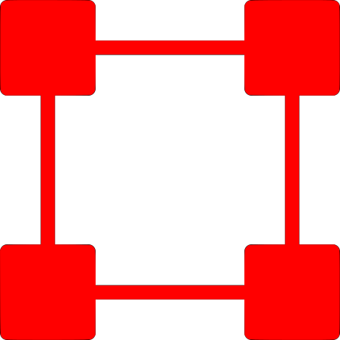

# JOSM-Russia-address-helper-plugin
Плагин JOSM для загрузки адресов из ЕГРН.

## Что такое ЕГРН
Единый Государственный Реестр Недвижимости - государственная геоинформационная система, содержащая информацию о обьектах недвижимости, границах,
инфраструктуре. В интернете доступен по адресу [nspd.gov.ru](https://nspd.gov.ru) (ранее [pkk.rosreestr.ru.](https://pkk.rosreestr.ru) C 12.2024 данные ЕГРН перенесны в слои НСПД)
ЕГРН [признан валидным](https://wiki.openstreetmap.org/wiki/RU:%D0%A0%D0%BE%D1%81%D1%81%D0%B8%D1%8F/%D0%9F%D1%83%D0%B1%D0%BB%D0%B8%D1%87%D0%BD%D0%B0%D1%8F_%D0%BA%D0%B0%D0%B4%D0%B0%D1%81%D1%82%D1%80%D0%BE%D0%B2%D0%B0%D1%8F_%D0%BA%D0%B0%D1%80%D1%82%D0%B0) (лицензионно совместимым) источником для ОСМ.
Плагин russia-address-helper позволяет в полуавтоматическом режиме извлекать текстовую информацию из слоев ЕГРН, в которой в большинстве случаев записан человекочитаемый адрес.

## Как работает плагин
В программе реализованы два режима работы - запрос по клику (он же "Пипетка") и массовая загрузка адресов. Запрос по клику позволяет узнать адресную информацию в произвольной точке.
Клик на карте отправляет координату запроса в ЕГРН, и, при получении не пустого ответа, пытается с помощью эвристик и регулярных выражений
разобрать текстовое описание полученных адресов на составляющие (в данный момент улицу и номер дома, в который может входить буква, корпус, строение, квартира,
так же распознаются населенные пункты (в случае когда нет адреса по улице), кварталы и микрорайоны).
Затем происходит сопоставление имя распознанной улицы/места с существующими в ОСМ.
При успешном разборе и сопоставлении на каждый найденный адрес в месте клика создается по точке с тэгами ("addr:housenumber", "addr:street").
Адресные точки будут созданы и для всех нераспознанных адресов тоже, что иногда помогает разобрать адрес вручную, или понять, почему он не валидный.
Все созданные инструментом "Пипетка" точки будут удалены при загрузке данных в ОСМ, и в базу не попадут.

С версии 0.9.5 запрос по клику позволяет импортировать геометрию зданий ЕГРН. При этом из атрибутивной информации плагин пытается определить тип здания ОСМ.
* Импортированная геометрия имеет следующие свойства:
- для частных домов зачастую отражает только контур здания на момент постановки на учёт, то есть без пристроев, гаражей и расширений. Контур необходимо корректировать, как правило, расширять.
- для общественных, производственных зданий контур может быть излишне сложным, например содержать импортированные видимо из CAD программ мелкие детали, ненужные в ОСМ (колонны). Контур необходимо корректировать, как правило, в сторону упрощения.
- для многоквартирных домов свежего года постройки контур может быть так же излишне сложным и включать в себя подземные обьекты, вроде парковок, заглубленных подвалов, выступов фундамента и коммуникаций. Контур надо упрощать с учетом того, что видно на уровне земли.
- часто содержит мелкие детали, которые убираются настройкой автоупрощения, однако при этом может потерять прямоугольность.
 
**Помните, если данные ПКК противоречат снимку или тем более, данным обхода, не вносите их!**

### Массовая загрузка
Этот режим считается основным, и позволяет обработать уже существующие в ОСМ здания, запросив в ЕГРН, распарсив и присвоив им адреса в автоматическом режиме.
Нужно выделить здания, и запустить массовую загрузку. Плагин профильтрует список выделенных зданий по следующим правилам:
- это линия или мультиполигон
- у нее есть тэг building и он не garage, shed или roof (настраивается)
- на ней нет тэга fixme (настраивается)
<br>Есть ограничение на размер выделения (задано в настройках), здания свыше лимита запрошены не будут.
<br>Для оставшихся в списке объектов программа находит координаты точки запроса - для прямоугольника это пересечение диагоналей, для зданий сложной формы ищется точка, гарантированно лежащая внутри фигуры здания.
Затем выполняется запрос в ЕГРН, полученные данные разбираются на улицу, место и номер дома, улица/место сопоставляется с объектами, уже внесенными в ОСМ. Если сопоставление прошло успешно,
адрес считается валидным, и присваивается зданию. Приоритет имеет адрес полученный со слоя ЕГРН `BUIDING`, если он есть. Проблемы, возникшие при разборе адреса и сопоставлении его с ОСМ,
обрабатываются валидаторами плагина, и отображаются в окне валидации JOSM. Их нужно обработать - исправить или проигнорировать. 

## Удаление дубликатов
При обработке частного сектора, промзон часто бывает, что на участке находится 2 и более строений, все они могут получить из ЕГРН одинаковый адрес.
Функция плагина 'Удаление дублей' после получения данных присвоит адрес только строению с наибольшей площадью.
Функция не трогает уже существующие в редакторе данные, т.е удаляются только загруженные из ЕГРН в данном запросе дубли.
Так же существует настройка дальности поиска дубликатов в метрах, чтобы не захватывать соседние НП или улицы-дубли в одном НП.
Для отображения и исправления дубликатов существует свой валидатор.


## Установка
Зайдите в `Настройки` Josm (клавиша `F12`), `Модули`, найдите плагин по названию ("russian-address-helper") или его части, нажмите `Установить`, перезапустите Josm. 
### Установка вручную
1. Скопируйте файл [russia-address-helper.jar](https://github.com/micronull/JOSM-Russia-address-helper-plugin/releases/latest/download/russia-address-helper.jar) в `%appdata%\JOSM\plugins` для Windows, и в `~/.local/share/JOSM/plugins` для Linux.
2. Включите плагин в `Правка - Настройки - Модули`.

## Как пользоваться
1. (**ОБЯЗАТЕЛЬНО**) Подключите слои ЕГРН в редактор JOSM одним из двух описанных тут вариантов:
    - ### Вариант 1: Работа через прокси-сервер nginx:
        1. Скачайте веб-прокси nginx с [сайта разработчика](https://nginx.org/ru/download.html), распакуйте в удобную вам папку. Nginx не требует прав администратора и установки в систему.
        2. Отредактируйте файл конфигурации прокси, находящийся по пути (папка из предыдущего шага/conf/nginx.conf), добавив в него следующие строки:
   ```
   server {
       listen 8081;
       server_name localhost;

        location / {
            proxy_pass              https://nspd.gov.ru/;
            proxy_ssl_verify        off;
        }
   }
   ```
    3. Запустите nginx просто двойным щелчком по nginx.exe. Он будет работать в фоновом режиме до момента перезапуска ПК.
    4. В JOSM нажмите F12, и в открывшемся меню настроек выберите слева «Настройки плагина ЕГРН \ Настройки сети». **Установите** галочку "Отключить SSL при запросах ЕГРН" и нажмите ОК.
    5. Выберите в JOSM пункт меню «Данные» — «Загрузка адресов из ЕГРН» - «Добавить слои WMS ПКК». В настройках слоев добавятся 4 новых слоя, с данными ЕГРН.
    6. Добавьте нужные вам слои в отображаемые через меню **«Слои»**
   
   - ### Вариант 2: Установка сертификатов Минцифры Российской Федерации в файл сертификатов JAVA машины
    1. Определите путь к файлу сертификатов `cacerts`. Для портативной установки JOSM он будет находится внутри директории программы, по пути `JAVA\lib\security\cacerts` (или схожему). Если вы запускаете jar файл редактора JOSM напрямую, без скачивания установщика, скорее всего он использует установленную в систему JAVA машину, путь к исполняемой директории которой можно узнать командой оболочки 
   ```
   echo %JAVA_HOME%
   ```
   Например, система выдала путь: C:\JDK\jdk-11.0.2, тогда полный путь к хранилищу скорее всего будет C:\JDK\jdk-11.0.2\lib\security\cacerts
    Еще один вариант определить используемую JOSM инсталляцию JAVA в системе - запустить редактор, открыть Диспетчер задач, и посмотреть путь к запущенным экземплярам программы java.exe
   2. Скачайте с [сайта Госуслуг](https://www.gosuslugi.ru/crt) сертификаты Минцифры (раздел "Сертификаты для Windows", кнопки "Скачать корневой сертификат" и "Скачать выпускающие сертификаты"). Распакуйте архив с выпускающими сертификатами в удобное для вас место, и скопируйте туда же скачанный корневой сертификат. Например, это папка "D:\certs"
   3. Создайте на всякий случай резервную копию файла cacerts
   4. Выполните в командной строке следующие команды (пути к cacerts и файлам сертификатов заменить на ваши): 
   ```
        keytool -v -importcert -alias RuRootCert -keystore "C:\JDK\jdk-11.0.2\lib\security\cacerts" -file "D:\certs\russian_trusted_root_ca.cer" -storepass changeit -trustcacerts
        keytool -v -importcert -alias Ru2cert -keystore "C:\JDK\jdk-11.0.2\lib\security\cacerts" -file "D:\certs\russian_trusted_sub_ca.cer" -storepass changeit -trustcacerts
        keytool -v -importcert -alias Ru3cert -keystore "C:\JDK\jdk-11.0.2\lib\security\cacerts" -file "D:\certs\russian_trusted_sub_ca_2024.cer" -storepass changeit -trustcacerts
   ```
    Если программа выдаст запрос "**Trust this certificate?**", нужно ввести 'Y' и нажать 'Enter'.
    Если вы все делаете правильно, после выполнения каждой из команд система должна написать **Certificate was added to keystore**
   5. Запустите (или перезапустите, если был запущен) редактор, нажмите F12, и в открывшемся меню настроек выберите слева «Настройки плагина ЕГРН \ Настройки сети». **Снимите** галочку "Отключить SSL при запросах ЕГРН" и нажмите ОК.
   6. Выберите в JOSM пункт меню «Данные» — «Загрузка адресов из ЕГРН» - «Добавить слои WMS ПКК». В настройках слоев добавятся 4 новых слоя, с данными ЕГРН.
   7. Добавьте нужные вам слои в отображаемые через меню **«Слои»**
   
3. Настройте [смещение основного слоя спутниковых снимков](https://wiki.openstreetmap.org/wiki/RU:JOSM/Plugins/Imagery_Offset_Database/Quick_Start#%D0%A1%D0%BC%D0%B5%D1%89%D0%B5%D0%BD%D0%B8%D0%B5_%D0%BF%D0%BE%D0%B4%D0%BB%D0%BE%D0%B6%D0%BA%D0%B8_%D0%B8_%D0%B5%D0%B3%D0%BE_%D0%B7%D0%B0%D0%B3%D1%80%D1%83%D0%B7%D0%BA%D0%B0) по GPS трекам (ссылка на вики ОСМ.)  
   
4. Настройте смещение слоев ПКК с границами зданий и/или участков по спутниковому снимку. Слой участков легко привязать в частном секторе, по заборам. При сдвиге слоя зданий не забывайте, что контур здания из ПКК должен лечь на фундамент здания на спутниковом снимке, а не на крышу. (Примечание: точность привязки и участков и зданий сильно плавает в зависимости от многих условий - рельефа конкретной местности, качества геодезических работ при сьемках и др. Сдвиг участков и зданий меняется от района к району, его надо регулярно корректировать, иначе плагин может запросить некорректный участок/здание.)

5. Зайдите в настройки плагина (горячая клавиша `F-12`, раздел "Настройки плагина ЕГРН \ Общие"). Выберите в выпадающем списке настройки "Сдвигать координаты запроса согласно сдвигу выбранного слоя" слой Зданий или участков. (Как правило, слой здании привязан точнее, и лучше выбрать его.)
6. (**Новое**) Настройте, какие слои данных будут запрашиваться для каждого из режимов. С переходом на новое АПИ, утрачена возможность запрашивать данные сразу с нескольких слоев, поэтому количество запросов возросло. Для каждого из режимов доступны 4 слоя: Здания, Участки, Сооружения, Обьекты незавершенного строительства. По умолчанию запрашиваются только Здания и Участки, поскольку в двух других слоях редко присутствует адресная информация. 

Плагин готов к работе.
**ВНИМАНИЕ** Настройка плагина "Отключить SSL при запросах ЕГРН" влияет на URL слоев, добавляемых плагином по действию "Добавить слои WMS ПКК" (при включенной настройке URL будут созданы с localhost вместо адреса сайта). Поэтому, если вы меняли значение этой настройки, выполните добавление слоев заново, чтобы пересоздать их с корректным URL.

5. Настройки редактора "Для удобства":
- вынесите кнопки плагина на панель инструментов. Для этого нажмите правой кнопкой на панель инструментов JOSM, выберите "Настроить панель инструментов", и добавьте кнопки из раздела "Действия - Данные - Загрузка адресов из ЕГРН"
- добавьте кнопку поиска зданий без адресов в области видимости. Для этого нажмите `ctrl+F`, введите в строке поиска `building=* AND -"addr:housenumber"=* AND inview` затем проставьте галочку "добавить кнопку на основную панель инструментов" и нажмите `Поиск`
 
6. Процесс работы
   1. добавление улиц: 
   - нарисуйте линии улиц. 
   - вариант 1 (с помощью Пипетки): с помощью инструмента Пипетка (Запрос на месте клика)  запросите адреса участков и/или зданий вдоль предполагаемой улицы, ориентируясь на приблизительные начало и конец улицы.
   Из содержания тэга "addr:RU:egrn" сгенерированных точек прочтите имя улицы, и присвойте его линиям улицы, обязательно преобразовав в [формат наименования ОСМ](https://wiki.openstreetmap.org/wiki/RU:%D0%A0%D0%BE%D1%81%D1%81%D0%B8%D1%8F/%D0%A1%D0%BE%D0%B3%D0%BB%D0%B0%D1%88%D0%B5%D0%BD%D0%B8%D0%B5_%D0%BE%D0%B1_%D0%B8%D0%BC%D0%B5%D0%BD%D0%BE%D0%B2%D0%B0%D0%BD%D0%B8%D0%B8_%D0%B4%D0%BE%D1%80%D0%BE%D0%B3).
   Сгенерированные плагином точки с тэгом fixme=REMOVE_ME! удалятся автоматически при загрузке в ОСМ.
   - вариант 2 : добавьте здания, запросите их адреса и исправьте ошибку валидатора "ЕГРН не найдена улица" 
   2. добавление зданий:
   - обрисуйте здания по спутниковому снимку или загрузите данные ОСМ, где здания уже обрисованы.
   - с помощью поискового запроса зданий без номера, либо инструмента выделения/лассо выделите разумное количество зданий (10-100) (Хороший вариант - выбрать полигон жилой застройки и воспользоваться функцией "Выделение - Все внутри"). Если попутно выделятся дороги или просто точки, ничего страшного, плагин отфильтрует их при запросе.
   - запросите данные с помощью кнопки "Для выделенных объектов"  . Поскольку сайт ЕГРН не очень стабильно отвечает на запросы, придется подождать некоторое время.
   - плагин обработает полученные данные по следующему алгоритму:
        1. если у здания/участка есть адрес, и он успешно разобран на составляющие, и для распознанных обьектов нашлось соответствие в данных ОСМ (найдена улица либо точка населенного пункта/квартала/микрорайона), и не найден дубликат, то зданию будет присвоен адрес.
        2. в остальных случаях плагин сгенерирует в окне валидации одну из возможных ошибок или предупреждений, которые нужно просмотреть и обработать:
            1. **ЕГРН пустой ответ**. Самоочевидное предупреждение. Оно генерируется в категории OTHER, вы не увидите его, если в настройках JOSM не включено отображение этой категории ошибок.
            2. **ЕГРН адрес найден**. Это предупреждение генерируется, если адрес успешно распознан и присвоен. Но **такие предупреждения все равно нужно обработать** - просмотреть глазами и убедиться, что алгоритм разбора не ошибся. Частая ошибка - присвоение зданию номера участка, он может совпадать с номером дома, а может и нет. Так же пока нерешенная проблема - номера участков в СНТ могут быть присвоены как адреса по деревне или НП, к которому приписано СНТ. Такие адреса в базу ОСМ загружать нельзя!
           При нажатии на кнопку "Исправить" отобразится диалог исправления в котором можно исправить адресные тэги, удалить уже присвоенные, либо проигнорировать ошибку.
            3. **ЕГРН несколько адресов**. Плагин получил в ответе несколько валидных адресов. Для исправления нужно выбрать один, как правило, это адрес здания, а не участка. Если ни один адрес на самом деле не подходит, можно проигнорировать ошибку. Частый вариант для домов на два хозяина, что у двух участков, на которых расположен дом, одинаковый адрес, а у частей здания - свои, с номерами квартир или через дробь. В таком случае нужно либо выдать адрес участка зданию, либо разбиь здание на две части и перезапросить адреса.
            4. **ЕГРН нечеткое совпадение**. Плагин сопоставил адрес с улицей или местом по алгоритму нечеткого совпадения, и теперь надо убедиться, что это не ложное срабатывание. Можно присвоить распознанные адресные тэги, или игнорировать эту ошибку.
            5. **ЕГРН содержит номер квартиры**. Адрес успешно присвоен, но в нем содержатся номера квартир. Можно сгенерировать адресную точку с номером квартиры (не обязательно и не вполне укладывается в логику ОСМ), или игнорировать ошибку.
            6. **ЕГРН не найдена улица**. Адрес был распознан, но в данных ОСМ не нашлось линии с подходящим именем. Возможна ошибка сопоставления плагина, или в данных ОСМ отсутствует линия дороги с подходящим названием.
            7. **ЕГРН не найдено место**. Адрес был распознан, но в данных ОСМ не нашлось объекта (точки, полигона или мультиполигона) с подходящим именем и тэгами.
            8. **ЕГРН дубликат адреса** Адрес был распознан, но он уже существует в ОСМ или среди других распознанных адресов. Диалог исправления предложит несколько вариантов разрешения проблемы, но как правило действие по умолчанию (назначить адрес зданию с максимальной площадью) является правильным.
            9. **ЕГРН ошибка разбора** Не удалось распознать адрес, но можно попробовать разобрать вручную, или игнорировать эту проблему.
            10. **ЕГРН граница места неполная** Распознанный адрес сопоставлен с границей места, нарисованной в ОСМ мультиполигоном. Но этот мультиполигон загружен не до конца и проверить адрес на вхождение в границу не получается. Надо догрузить границу вручную.
            11. **ЕГРН вне границ места** Дом с распознанным адресом не лежит внутри полигона/мультиполигона границы. 
            12. **ЕГРН место слишком далеко** Адрес дома сопоставлен с местом, у которого нет (мульти)полигональной границы, а точка места находится слишком далеко (дальше заданного в настройках значения).
            13. **ЕГРН улица слишком далеко** Адрес дома сопоставлен с линией улицы, которая находится слишком далеко (дальше заданного в настройках значения). Это может быть одноименная улица в соседнем НП, или же линия улицы требует продолжения.
            14. **ЕГРН конфликт данных** Полученные из ЕГРН данные конфликтуют с уже существующими в ОСМ. Необходимо вручную выбрать правильные значения или оставить все как есть.

## Горячая клавиша

1. Добавьте кнопку на панель инструментов в  `Правка - Настройки - Панель инструментов`. 
2. Нажмите правой кнопкой по иконке плагина на панели инструментов и выберите `Свойства горячей клавиши`.


## Ограничения плагина

1. Не выделяйте много домов сразу, при большом количестве одномоментных запросов (приблизительно >500) сервис ЕГРН может выдать бан по IP на сутки. В плагин встроен лимит (по умолчанию - 200) зданий в одном запросе, выделение сверх того запрашиваться не будет. Нормальный способ работать - выделяя дома вдоль улицы или в небольшой области, приводить данные в порядок, выгружать данные в базу ОСМ, и уже после этого приступать к следующим. (О новом АПИ пока неизвестны пределы его ограничений, но не стоит злоупотреблять его открытостью)
2. На данный момент ошибка пропадет из списка валидации, если зайти в диалог ее исправления и закрыть окошко крестиком или выбрать "Отмена". При этом ошибка не будет исправлена. Это проблема кода валидации JOSM, обходной путь - нажать в окне валидаторов кнопку "Валидировать". Неисправленная ошибка снова отобразится.
3. Плагин не может корректно разобрать 100% полученных адресов, поскольку есть:

## Ограничения ЕГРН
1. Целью ЕГРН не является сбор и хранение адресных данных, это побочный продукт ведения земельных и имущественных реестров.
2. Адрес ЕГРН в зависимости от региона, конкретного НП и конкретного работника Росреестра, заполнявшего данные на участок/здание, может иметь почти произвольный формат и содержание,
включать адресацию по территориям, СНТ, гаражным кооперативам, ориентирам на местности, инвентарные номера, старый адрес, адрес прописью, примечания работника и так далее.
3. Адрес ЕГРН может просто не соответствовать действительности в результате опечатки, изменения адресов и миллиона других причин (встречалось неоднократно)

Вывод - приоритет во внесении в ОСМ всегда является truth on the ground - проверенная на местности адресная табличка, или хотя бы увиденная на снимках разрешенных к использованию панорам (Яндекс). Никакие другие картографические материалы, за исключением может быть официальных документов сельских, городских администраций,
источником адресной информации или эталоном для ее сверки быть не могут. Многие старые или современные картографические ресурсы черпают данные ровно из тех же источников вроде ЕГРН или устаревших схем НП, повторяя снова и снова ошибки. Если адрес полученный из ЕГРН странно выглядит, выбивается из соседних, или, тем более, противоречит внесенному при обходе - не вносите его в базу ОСМ! 


## Общая информация

* Плагин на данный момент может разобрать данные только для улиц, переулков, проездов, проспектов, бульваров, шоссе, аллей, тупиков, площадей, кварталов, микрорайонов (обозначенных точкой или мульти/полигоном place=neighbourhood, suburb, quarter), деревень, сёл и поселков (обозначенных точкой или мульти/полигоном) c тэгом place=village, hamlet). 
* Если в ЕГРН встречается многократное именование улицы, которое не может быть сопоставлено с данными ОСМ ("Советская Б улица"), в качестве временного решения можно добавить улице в ОСМ тэг "egrn_name", в который вписать наименование из ЕГРН. При загрузке в ОСМ тэг egrn_name удалится автоматически.
* Плагин умеет сопоставлять номерные улицы и улицы с инициалами ("улица Карла Маркса" сопоставится с "ул. К. Маркса")
* Программа пытается распознать номер дома с учетом строения, корпуса, буквы. Номера квартир в адресе приведут к генерации предупреждения валидатора, в диалоге которого можно сгенерировать дополнительные точки адреса с тэгами `addr:flats`. Понимания, что делать с такими данными пока нет, лучше не загружать их в ОСМ.

## Запрос дополнительных данных
Точечный запрос  формирует на точке дополнительные тэги при запросе данных ЕГРН, который вернёт в тэгах с префиксом "egrn:" следующие потенциально полезные поля:

| Тэг                               | Описание                                                                                                                |
|-----------------------------------|-------------------------------------------------------------------------------------------------------------------------|
| cad_num                           | Кадастровый номер ЕГРН участка/здания                                                                                   |
| buildRecordTypeValue              | Тип здания                                                                                                              |
| levels                            | Расчетная этажность здания (общее количество этажей минус количество подземных, при условии, что оба значения числовые) |
| purpose                           | Назначение здания по справочнику ЕГРН                                                                                   |
| permittedUseEstablishedByDocument | Разрешенное использование земельного участка                                                                            |
| ownershipType                     | Тип собственности                                                                                                       |
| descr                             | Обычно информация о типе и назначении здания/участка (магазин, дом, школа, клуб, и т.п)                                 |
| year_built                        | Год постройки здания                                                                                                    |
| year_comissioning                 | Год ввода в эксплуатацию                                                                                                |
| materials                         | Основной материал конструкции здания                                                                                    |
| categoryName                      | Наименование категории объекта                                                                                          |

Следует отметить, что назначение здания может меняться, не факт что это корректно отражено в ЕГРН. Неизвестно, как именно формируется этажность для многоквартирных домов с подъездами переменной этажности (может быть записана этажность минимальная-максимальная).
## Настройки
### Настройки общие
- Настройки слоев запроса. Определяет, какие именно слои будут запрошены для каждого типа действия. Как правило, для массового запроса достаточно слоев Зданий и Кадастровых участков.
- Сдвигать координаты запросов согласно сдвигу выбранного слоя. Настройка, позволяющая скорректировать запросы к АПИ по сдвигу слоя.
- Записывать сырой адрес из ЕГРН в тег `addr:RU:egrn`. Рекомендуется держать включенной. Добавляет необработанную адресную информацию в тэг "addr:RU:egrn" каждого обьекта, что позволяет вручную проверить данные. При загрузке в ОСМ тэг автоматически удаляется и не отправляется на сервер.
- Расстояние поиска дубликатов. Настройка алгоритма поиска дублей адреса, позволяющая отсеять ложные дубликаты, например адреса по улице с таким же именем, но в другом населенном пункте. Может привести к возникновению дублей адресов в промзонах, где расстояние между соседними зданиями может быть очень велико.
### Настройки сети
 - "Отключить SSL при запросх к ЕГРН". При установленной галочке подразумевается наличие запущенного прокси nginx. Формируемые действием "Добавить слои WMS ПКК" адреса слоев содержат в качестве адреса сайта localhost:8081. При снятой галочке обращение идет напрямую к nspd.gov.ru, необходима установка сертификатов в хранилище JAVA машины. 
 - URL адрес запроса ЕГРН: шаблон запроса данных из слоев ПКК НСПД. Менять не рекомендуется.
 - UserAgent запроса ЕГРН: поле UserAgent заголовка запроса. Менять не рекомендуется.
 - Лимит одновременных запросов. Количество одновременных запросов к АПИ. Менять не рекомендуется.
 - Лимит количества зданий в запросе массовой загрузки. Ограничение на единократный запрос к АПИ. Выделение будет ограничено лимитом, отобразится предупреждение.
 - Задержка между запросами в секундах. 
 - Всего запросов к ЕГРН в текущей сессии. Информационное поле.
 - Разрешение окна запроса, пикселей на метр. Значение, управляющее расчетом параметров запроса width и height (ширина/высота окна запроса в метрах * разрешение). При малых значениях, порядка 0.5-2 наблюдается "толерантность" запроса к ближним границам, те. для здания, находящегося близко к границе участка вернется не только адрес участка, на котором находится здание, но и ближнего тоже,
 - Расширение окна запроса вокруг объекта, метры. Значение, определяющее границы запроса к АПИ - границы здания + расширение.
### Настройки запроса по клику
 - Импортировать геометрию из ПКК - при наличии в слое Здания информации о контурах здания, контур будет импортирован в редактор, при этом ему будет присвоен адрес (или он попадёт в валидаторы адресов)
 - Фильтровать полигоны менее чем, м. кв - из импортированных данных будут убраны полигоны или части мультиполигона площадью меньше заданной.
 - Упрощать импортированную геометрию. - к импортированной геометрии будет применена стандартная операция Упрощения `Shift+Y` редактора. Если упрощение удалит вершины, количество удаленных будет отображено в оповещении. Можно откатить упрощение через 'Shift+Z'
 - Предел сдвига точек при упрощении - настройка алгоритма упрощения.
 - Обьединять данные слоев на одной точке - атрибутивные данные здания и участка будут обьединены на одной точке, при этом дублирующимся тэгам будет приписан суффикс слоя, откуда получены данные и номер обьекта, если их было получено больше одного.
 - Запрашивать по клику в радиусе, м - размеры окна запроса к АПИ при запросе по клику.
### Настройки запроса выделения
 - таблица, определяющая при наличии каких тэгов на обьекте он будет исключен из запроса. В первом столбце приведен тэг, во втором - значения, через запятую. Знак `*` совпадает с любым значением. По умолчанию исключаются здания уже имеющие номер дома, тэг fixme, и набор тэгов типа здания `garage,shed,roof,shack,garages`
 - Проставлять дополнительные тэги по данным ЕГРН. Данная настройка проставит тэги building=тип здания ЕГРН, building:levels, start_date при условии, что их можно определить из ЕГРН и эти данные отсутствуют в ОСМ. Никакие данные уже присутствующие в ОСМ не перезаписываются!
### Настройки типа здания
- Тип здания выводится из данных ЕГРН согласно этой таблице. Значения, полученные в полях `descr` и `purpose` проверяются на вхождение подстрок из столбца `Подстроки ЕГРН`. Индивидуальные подстроки разделяются запятыми. Порядок проверки определяется порядком строк таблицы. Первое совпадение определяет результат. При отсутствии совпадения присваивается `building=yes`
### Настройки валидации
Линия улицы должна быть ближе чем, метров. Расстояние от здания с адресом по улице, до ближайшей линии с тем же именем улицы, превышение которого приведёт к срабатыванию валидатора "Улица слишком далеко"
Точка места должна быть ближе чем, метров. Расстояние от здания с адресом по месту, до ближайшей точки с тем же именем места, превышение которого приведёт к срабатыванию валидатора "Место слишком далеко"


## Изменения  

[см. CHANGELOG.md](https://github.com/micronull/JOSM-Russia-address-helper-plugin/blob/master/CHANGELOG.md)